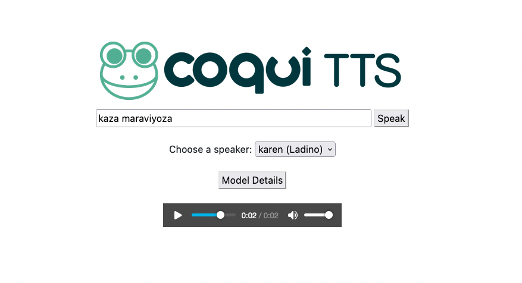

# TTS API

This is a simple TTS API based on the 🐸 [Coqui TTS demo server](https://github.com/coqui-ai/TTS/tree/dev/TTS/server). Additional features are:

- Loading multiple models at startup
- Model configuration specification with JSON format file (`config.json`)
- Easy docker installation
- Modular and language specific text normalization 
- (Future) Multi-system support	
	- Coqui TTS
	- ???

## Setup and installation

Start by cloning this repository and create your models directory:
```
git clone https://github.com/CollectivaT-dev/TTS-API.git
cd TTS-API
mkdir models
```

To run the API you need to first fetch your models and put them under the directory `models` (or know their exact path in your system). e.g.

```
TTS-API
    ↳ ...
    ↳ models
    	↳ my-tts-model.pth
        ↳ my-tts-model.config
        ↳ my-vocoder-model.pth
        ↳ my-vocoder-model.config
    ↳ ...
```

Then you need to setup the `config.json` file which contains information about your models. An example is provided below with explanations:

```
{
    "languages":{"en":"English", "es":"Spanish", "tr":"Turkish", "lad":"Ladino", "ca":"Catalan"}, <--- This is a dictionary mapping language codes to human-readable language name
    "models": [
        {
            "voice": "karen",			<--- Name of your voice
            "lang": "lad", 			<--- Language code
            "model_type": "coqui",  		<--- TTS system id
            "tts_config_path": "config.json",	<--- Path to TTS model configuration file 
            "tts_model_path": "checkpoint.pth",	<--- Path to TTS model checkpoint 
            "load": true 			<--- Flag to load at startup
        },
        {
            "voice": "pau",
            "lang": "ca",
            "model_type": "coqui",
            "tts_config_path": "pau-config.json",
            "tts_model_path": "pau-tts.pth.tar",
            "vocoder_config_path": "vocoder-config.json",	<--- Path to Vocoder model configuration file (if you have)
            "vocoder_model_path": "vocoder-model.pth.tar",	<--- Path to Vocoder checkpoint (if you have)
            "load": false
        }
    ]
}
```

As for paths, you can place full path or just its filename if it's placed under `models`.

### Run with docker compose (recommended)

This will take care of all installations for you.

```
docker compose build
docker compose up
```

### Run with local installation

You might want to create a virtual environment before doing this option.

```
pip install -r requirements_local.txt
gunicorn server:app -b :5050 #or whatever port you like
```

or if you have everything already setup
```
./run_local.sh
```

## API usage

There's currently one API endpoint at `/api/tts`. Text and voice parameters are specified as values. 

```
curl -L -X GET 'http://localhost:5050/api/tts?text=kaza+maraviyosa&voice=karen' --output maraviyoza.wav
```

## Demo page

A simple user interface is served at [http://localhost:5050](http://localhost:5050). If you like a different header, just replace `static/header.png` with an image you like.



## Language specific text normalization

One usually needs to normalize certain textual expressions into their spoken form for proper synthesis. These expressions include:

- Addresses
- Telephone numbers
- Numbers
- E-mail addresses 

You can specify how these conversions should be done for your language. To do that, 

1. Create a directory named with your language code under `utils/preprocessors`
2. Create a script called `preprocessor.py` under that directory
3. Define a function with the name `text_preprocess` inside `preprocessor.py` that takes the input text as input and returns the normalized form.

You can follow the templates we provided for two languages Catalan (`ca`) and Ladino (`lad`). 

